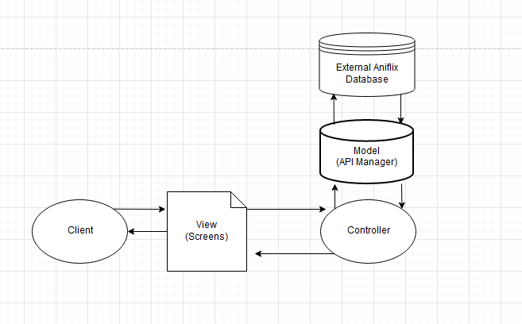
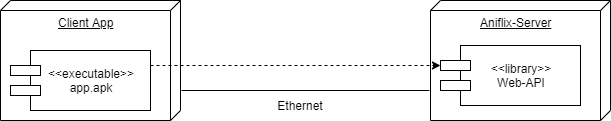

# AniflixApp-Team  - Software Architecture Document

## Table of Contents
- [1. Introduction](#1-introduction)
    - [1.1 Purpose](#11-purpose)
    - [1.2 Scope](#12-scope)
    - [1.3 Definitions, Acronyms and Abbreviations](#13-definitions-acronyms-and-abbreviations)
    - [1.4 References](#14-references)
    - [1.5 Overview](#15-overview)
- [2. Architectural Representation](#2-architectural-representation)
    - [2.1 Technologies used](#21-technologies-used)
- [3. Architectural Goals and Constraints](#3-architectural-goals-and-constraints)
- [4. Use-Case View](#4-use-case-view)
    - [4.1 Use-Case Realizations](#41-use-case-realizations)
- [5. Logical View](#5-logical-view)
    - [5.1 Overview](#51-overview)
	- [5.2 Architecturally Significant Design Packages](#52-architecturally-significant-design-packages)
- [6. Process View](#6-process-view)
- [7. Deployment View](#7-deployment-view)
- [8. Implementation View](#8-implementation-view)
    - [8.1 Overview](#81-overview)
    - [8.2 Layers](#82-layers)
- [9. Data View](#9-data-view)
- [10. Size and Performance](#10-size-and-performance)
- [11. Quality](#11-quality)

## 1. Introduction
### 1.1 Purpose
This document provides an architectural overview of the our system and should help to easily understand our software.
### 1.2 Scope
The scope of this SAD is to show the overall architecture of the AniflixApp project. Use-Cases and classes are depicted.
### 1.3 Definitions, Acronyms and Abbreviations
Abbreviation | |
--- | --- 
IDE | Integrated Development Environment
MVC | Model View Controller
n/a | not applicable  
SAD | Software Architecture Document
SRS | Software Requirements Specification
tbd | to be determined
UC | Use Case

Definition | |  
--- | ---  
Software Architecture Document | The Software Architecture Document provides a comprehensive architectural overview of the system, using a number of different architectural views to depict different aspects of the system.
### 1.4 References
Title | Date | Publishing organization |  
--- | :---:  | ---
[AniflixApp Blog](https://aniflixapp.wordpress.com/) | 05.10.2019 | AniflixApp-Team  
[YouTrack Instance (not public for the moment)](https://aniflixapp.myjetbrains.com/youtrack/) | 05.10.2019 | AniflixApp-Team  
[SRS](../SRS/SRS.md) | 24.10.2019 | AniflixApp-Team  
[SAD](../SAD/SAD.md) | 28.11.2019 | AniflixApp-Team  
### 1.5 Overview
All necessary architectural details will be described in the following sections. This includes a database diagram, which gives an overview about the project structure.
Furthermore, the architectural representation, goals and constraints are clarified in this document.

## 2. Architectural Representation
Our application is build using flutter, Google's UI toolkit for building applications. 
IDEs:
- Frontend: JetBrains IntelliJ

Languages:
- Frontend: Flutter, Dart
- Testing: Flutter Gherkin

## 3. Architectural Goals and Constraints
Since we use flutter to create a mobile app MVC is already inhereted. We got our main.dart as controller that decides which view is shown, our different screens and the screen components together as views and different classes which get filled with the data of our API calls. This classes work as our models.

[Link to class diagram](../Diagrams/class_diagramm.svg)

## 4. Use-Case View
![OUCD]
### 4.1 Use-Case Realizations
- [UC Get last seen, Get new episodes, Get airing animes, Get discover animes](../UC/UC_Get_Anime_HomePage.md)
- [UC See subscribed animes](../UC/UC_See_sub_box.md)
- [UC Switch between main pages](../UC/UC_Switch%20pages.md)
- [UC Play Episode](../UC/UC_Play_Episode.md)
- [UC Write Comments](../UC/UC_Write_Comments.md)
- [UC Change Theme](../UC/UC_Change_Theme.md)
- [UC Ads](../UC/UC_Ads.md)
- [UC Profile Pages](../UC/UC_Profile_Pages.md)

## 5. Logical View
### 5.1 Overview
The following graphic describes the overall class organization of our app.

### 5.2 Architecturally Significant Design Packages
Our frontend mainly contains our different screens that include different UI components. Together they work as our views. The backend includes our main.dart as our controller and different API calls that fill our models.

If you want to see the class diagram you have to download it from our Git and open it with your browser. Because we are very advanced in development our class diagram is very large and confusing.

[Link to class diagram](../Diagrams/class_diagramm.svg)

## 6. Process View
n/a

## 7. Deployment View  

## 8. Implementation View

[Link to class diagram](../Diagrams/class_diagramm.svg)

[Link to code](../Aniflix-App)

## 9. Data View
We don't use any own database. The data is stored on the aniflix database where we only have access to over our API calls. So we can't show the database structure because it is only available for the aniflix admin and development team.

## 10. Size and Performance
In our application we cache some informations for better performance:  
-Homepage Start data
-Subbox data
-Anime list data
-Logged in user
-Calendar data
-History
-Watchlist
-Userlist data

## 11. Quality
For the project we used MVC with flutter. It helped us maintain the code and run a stable version of our app. It was easy to extend the app with this model.  
With [dart_metrics](https://pub.dev/packages/dart_code_metrics) we calculated the metrics of our code. It calculates the metrics for following points:
-Cyclomatic complexity of methods
-Too long methods
-Number of arguments
-Number of methods
With this tool it was much easier to improve our code. It shows us the spots where the metrics report any errors, so we know where we have to improve our code.

## 12. Pattern
We used the composite design pattern at some spots in our code.  
Here is an example the code before:

And after:

This design pattern is built like a tree hierarchy. The lower classes inherit the properties of the classes above them.

<!-- Picture-Link definitions: -->
[OUCD]: <../UCD_Main.png> "Overall Use Case Diagramm"