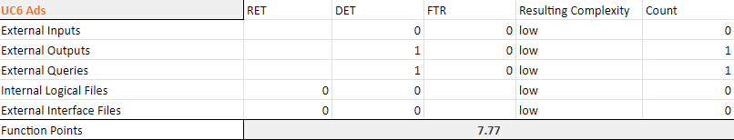

# Use-Case Specification: Ads

# 1. Ads

## 1.1 Brief Description
You will get an Ad displayed on the Top of the App, that will generate some Money for us.

## 1.2 Mockup
n/a

## 1.3 Screenshot

# 2. Flow of Events

## 2.1 Basic Flow

### Activity Diagram

### .feature File

n/a

## 2.2 Alternative Flows
n/a

# 3. Special Requirements
n/a

# 4. Preconditions
The main preconditions for this use case are:

 - The Google Ad Api needs to provide an Ad for us to display 

# 5. Postconditions

n/a

# 6. Function Points
