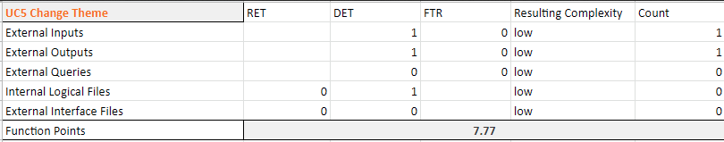

# Use-Case Specification: Change Theme

# 1. Change Theme

## 1.1 Brief Description
You go to the settings page and click on the Change Theme Dropdown-Button. The System get all existing Themes and the UI shows them as Dropdown-Menu. The User can choose one and the System will change the Theme for all Pages, Icons and Bars. The UI will show the Settings Page with the new Theme right after choosing a new Theme.

## 1.2 Mockup
n/a

## 1.3 Screenshot

# 2. Flow of Events

## 2.1 Basic Flow

### Activity Diagram

### .feature File

## 2.2 Alternative Flows
n/a

# 3. Special Requirements
n/a

# 4. Preconditions
The main preconditions for this use case are:

 - The user opened the settings page
 - The user has a registered account

# 5. Postconditions

The main postconditions for this use case are:

 - The Theme of the complete App has changed to the chosen one.

# 6. Function Points
