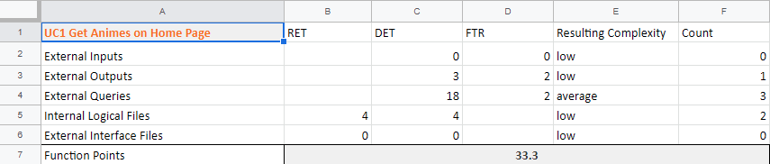

# Use-Case Specification: Get home page anime

# 1. Get home page anime

## 1.1 Brief Description
The app will send a request to the server to get the lists of animes that will be shown on the homepage. The server will return a list of the recently watched animes, of the new epsiodes uploaded to aniflix, of the new anime releases on aniflix and a list of animes you could like based on your recently watched animes.

## 1.2 Mockup

## 1.3 Screenshot

# 2. Flow of Events

## 2.1 Basic Flow

### Activity Diagram

### .feature File

  
[Get homepage animes feature file](../feature%20files/feature%20HomePage.PNG)

## 2.2 Alternative Flows
n/a

# 3. Special Requirements
n/a

# 4. Preconditions
The main preconditions for this use case are:

 - The user started the app.
 - The user have an internet connection.

# 5. Postconditions

The main postconditions for this use case are:

 - The home page shows the different lists returned by the API.

# 6. Function Points
